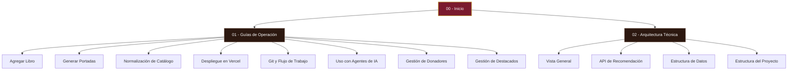

# 🧠 Cerebro Digital — Biblioteca Digital

Bienvenido al **Cerebro Digital** de tu Biblioteca Digital. Este espacio está diseñado como una bóveda de Obsidian para consolidar toda la información técnica y operativa de tu catálogo visual y recomendador IA.

---

## 🗺️ Mapa de Contenido (MOC)

### 📋 [01 - Guías de Operación]([[01 - Guías de Operación]])
Procedimientos operativos estándar (SOP) para el mantenimiento y actualización del catálogo.
*   [[Guía - Agregar Libro|Guía: Agregar Libro al Catálogo]]: Instrucciones para registrar nuevos PDFs.
*   [[Guía - Generar Portadas|Guía: Generación de Portadas]]: Extracción de WebPs desde tus PDFs.
*   [[Guía - Normalización de Catálogo|Guía: Normalizar Datos]]: Consolidación de géneros y limpieza de títulos.
*   [[Guía - Despliegue en Vercel|Guía: Despliegue en Vercel]]: Configuración y comandos de producción.
*   [[Guía - Git y Flujo de Trabajo|Guía: Comandos de Git]]: Flujo de trabajo para actualizar la web.
*   [[Guía - Uso con Agentes de IA|Guía: Uso con Agentes de IA (Claude/Hermes)]]: Cómo guiar a otras IAs de forma eficiente y económica.
*   [[Guía - Gestión de Donadores|Guía: Gestión de Donadores y Códigos]]: Administración de accesos, límites y comandos locales de terminal.
*   [[Guía - Gestión de Libros Destacados|Guía: Gestión de Libros Destacados]]: Administración de la sección de recomendados en la Home.

### ⚙️ [02 - Arquitectura Técnica]([[02 - Arquitectura Técnica]])
Documentación técnica sobre cómo está construido el sistema.
*   [[Arquitectura - Vista General|Vista General de la Arquitectura]]: Stack tecnológico y decisiones clave.
*   [[Arquitectura - API de Recomendación|API de Recomendación]]: La integración con la IA de DeepSeek v4 Flash.
*   [[Arquitectura - Estructura de Datos|Estructura de Datos (JSON)]]: Desglose de `libros.json`.
*   [[Arquitectura - Estructura del Proyecto|Estructura del Proyecto (Archivos)]]: Mapeo de directorios.

---

## ⚡ Enlaces Rápidos
*   **Repositorio Local:** `/home/daniel/biblioteca/`
*   **PDFs Almacenados:** `/home/daniel/biblioteca-digital/`
*   **URL de Producción Vercel:** [https://biblioteca-digital-eight.vercel.app/](https://biblioteca-digital-eight.vercel.app/)

> [!tip] Navegación en Obsidian
> Presiona `Ctrl + clic` (o `Cmd + clic` en Mac) sobre cualquiera de los enlaces con corchetes dobles para abrir la nota correspondiente en una nueva pestaña o panel lateral.
