# 🧠 Cerebro Digital — Libractiva

Bienvenido al **Cerebro Digital** de **Libractiva**. Este espacio está diseñado como una bóveda de Obsidian para consolidar toda la información técnica, operativa y de identidad de nuestro catálogo visual y recomendador IA.

---

## 🗺️ Mapa de Contenido (MOC)

```mermaid
graph TD
    Inicio[00 - Inicio] --> Guias[01 - Guías de Operación]
    Inicio --> Arq[02 - Arquitectura Técnica]
    Inicio --> Identidad[03 - Identidad y Marca]

    Guias --> G1[Agregar Libro]
    Guias --> G2[Generar Portadas]
    Guias --> G3[Normalización de Catálogo]
    Guias --> G4[Despliegue en Vercel]
    Guias --> G5[Git y Flujo de Trabajo]
    Guias --> G6[Uso con Agentes de IA]
    Guias --> G7[Gestión de Accesos]
    Guias --> G8[Gestión de Destacados]
    Guias --> G9[Gestión de Colecciones]

    Arq --> A1[Vista General]
    Arq --> A2[API de Recomendación]
    Arq --> A3[Estructura de Datos]
    Arq --> A4[Estructura del Proyecto]
    Arq --> A5[Auditoría y Rendimiento]

    Identidad --> I1[Marca - Libractiva]
    
    style Inicio fill:#7a1a2e,stroke:#b8892a,stroke-width:2px,color:#fff
    style Guias fill:#2c1810,stroke:#8a7060,color:#fff
    style Arq fill:#2c1810,stroke:#8a7060,color:#fff
    style Identidad fill:#b8892a,stroke:#7a1a2e,color:#000
```

### 📄 [[resumen_ejecutivo|Resumen Ejecutivo de Libractiva]]
Visión consolidada y síntesis estratégica del proyecto, incluyendo identidad de marca, descripción del logotipo, arquitectura de software y stack tecnológico.

### 📋 [01 - Guías de Operación]([[01 - Guías de Operación]])
Procedimientos operativos estándar (SOP) para el mantenimiento y actualización del catálogo de Libractiva.
*   [[Guía - Agregar Libro|Guía: Agregar Libro al Catálogo]]: Instrucciones para registrar nuevos PDFs.
*   [[Guía - Generar Portadas|Guía: Generación de Portadas]]: Extracción de miniaturas WebP desde tus PDFs.
*   [[Guía - Normalización de Catálogo|Guía: Normalizar Datos]]: Consolidación de géneros y limpieza de títulos.
*   [[Guía - Despliegue en Vercel|Guía: Despliegue en Vercel]]: Configuración de variables de entorno y comandos de producción.
*   [[Guía - Git y Flujo de Trabajo|Guía: Comandos de Git]]: Flujo de trabajo para actualizar la web.
*   [[Guía - Uso con Agentes de IA|Guía: Uso con Agentes de IA]]: Cómo guiar a otras IAs de forma eficiente y económica.
*   [[Guía - Gestión de Accesos|Guía: Gestión de Accesos y Códigos]]: Administración de accesos, límites de dispositivos y comandos CLI.
*   [[Guía - Gestión de Libros Destacados|Guía: Gestión de Libros Destacados]]: Administración de la sección de recomendados en la Home.
*   [[Guía - Gestión de Colecciones|Guía: Gestión de Colecciones (Packs)]]: Estructura de packs y cómo asociar IDs de libros en colecciones.json.

### ⚙️ [02 - Arquitectura Técnica]([[02 - Arquitectura Técnica]])
Documentación técnica sobre el diseño conceptual y desarrollo de Libractiva.
*   [[Arquitectura - Vista General|Vista General de la Arquitectura]]: Stack tecnológico y decisiones clave.
*   [[Arquitectura - API de Recomendación|API de Recomendación]]: La integración serverless con DeepSeek v4 Flash.
*   [[Arquitectura - Estructura de Datos|Estructura de Datos (JSON & Redis)]]: Desglose de `libros.json` y esquema KV.
*   [[Arquitectura - Estructura del Proyecto|Estructura del Proyecto (Archivos)]]: Mapeo de directorios del repositorio.
*   [[Arquitectura - Auditoría y Rendimiento|Auditoría y Rendimiento]]: Optimización de tokens, cookies HMAC y Cloudflare R2.

### 🎨 [03 - Identidad y Marca]([[03 - Identidad y Marca]])
Definición y estrategia de la evolución de marca.
*   [[Marca - Libractiva|Estrategia de Marca Libractiva]]: Justificación fonética, SEO, dominios y recursos gráficos.
*   [[Modelo de Negocio|Modelo de Negocio (LTD $100 MXN)]]: Estrategia de monetización, pasarela de pago y flujo de venta.
*   [[Copywriting y Estrategia de Anuncios|Copywriting y Estrategia de Anuncios]]: Argumentos de venta, ganchos de copy y ganchos psicológicos.

---

## ⚡ Enlaces Rápidos
*   **Repositorio Local:** `/home/daniel/biblioteca/`
*   **PDFs Almacenados:** `/home/daniel/biblioteca-digital/`
*   **URL de Producción Vercel:** [https://biblioteca-digital-eight.vercel.app/](https://biblioteca-digital-eight.vercel.app/) *(En transición a dominio Libractiva)*

> [!tip] Navegación en Obsidian
> Presiona `Ctrl + clic` (o `Cmd + clic` en Mac) sobre cualquiera de los enlaces con corchetes dobles para abrir la nota correspondiente en una nueva pestaña o panel lateral.
