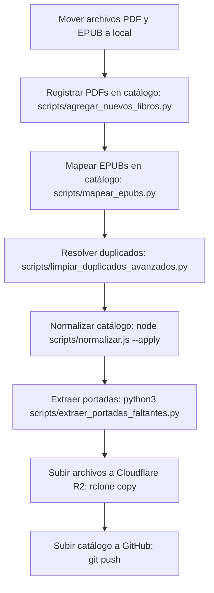

# 📖 Guía: Carga y Gestión de Libros (PDF, EPUB y Carga Masiva)

Esta guía describe los procedimientos y flujos de trabajo para añadir, mapear y sincronizar nuevos títulos en el catálogo de **Libractiva**, tanto en formato **PDF** como **EPUB**, utilizando herramientas automatizadas e interactivas de importación, saneamiento y sincronización con la nube.

---

## 🆚 Diferencias entre Scripts de Catalogación

Contamos con dos scripts en Python destinados a registrar libros en la base de datos `libros.json`. Su uso depende de la situación:

### 1. `agregar_libro.py` (En la raíz)
* **Propósito:** Carga unitaria (libro por libro) desde un archivo local, remoto de Drive o directamente ya copiado en la biblioteca.
* **Flujo:** Te pregunta de dónde proviene el archivo PDF y sus metadatos (Título, Autor, Año, Género, Descripción). Copia el archivo automáticamente y genera la portada al instante, ofreciendo además hacer un `git push`.
* **Cuándo usarlo:** Cuando deseas registrar un solo título individual.

### 2. `scripts/agregar_nuevos_libros.py` (En la carpeta `/scripts`)
* **Propósito:** Carga masiva de libros (a granel) previamente copiados en `/home/daniel/biblioteca-digital/`.
* **Flujo:** Escanea de forma recursiva toda tu biblioteca local buscando archivos PDF que **no existan** en `libros.json`. Para cada libro no indexado que detecta, abre un **asistente interactivo en caliente** preguntándote por consola:
  - Confirmación/Edición del Título autodetectado.
  - Confirmación/Edición del Autor autodetectado.
  - Año de publicación (estrictamente numérico, o 0 para nulo).
  - Género (elegido de una lista popular de géneros o escribiendo uno nuevo).
  - Descripción breve del libro (sin textos genéricos).
* **Cuándo usarlo:** Cuando copiaste un lote de múltiples PDFs nuevos a tu disco y quieres registrarlos de forma masiva pero ingresándoles su metadata real paso a paso sin comandos complejos.

---

## ⚡ El Formato EPUB en Libractiva

Hemos incorporado soporte completo para descargas en formato **EPUB**. Los beneficios clave de ofrecer este formato a los donadores son:
- **Lectura Adaptativa (Flowable Text):** A diferencia del PDF, el EPUB adapta el texto al tamaño de pantalla del dispositivo (móviles, tablets y lectores electrónicos).
- **Compatibilidad con E-readers:** Formato ideal e indispensable para disfrutar de la lectura en dispositivos dedicados como **Kindle**, Kobo o aplicaciones móviles de lectura (Apple Books, Google Play Books).
- **Bajo Consumo de Espacio:** El peso de los archivos EPUB suele ser significativamente menor que el de un PDF escaneado, lo que agiliza su descarga y optimiza el almacenamiento.

---

## 🔄 Flujo de Trabajo General (Carga Masiva)



---

## 📂 Organización de Archivos en Local

Los libros físicos deben organizarse localmente en la carpeta `/home/daniel/biblioteca-digital/` con la siguiente estructura de directorios:

### Para archivos PDF:
```text
/home/daniel/biblioteca-digital/
├── A/
│   └── Allende, Isabel/
│       └── La casa de los espíritus - Isabel Allende.pdf
├── B/
│   └── Borges, Jorge Luis/
│       └── El Aleph - Jorge Luis Borges.pdf
```
*Las carpetas alfabéticas van de la `A` a la `Z`. La carpeta del autor sigue el formato `Apellido, Nombre`, mientras que el archivo del libro se nombra `{Título} - {Autor}.pdf`.*

### Para archivos EPUB:
Los EPUBs siguen exactamente la misma estructura de carpetas pero deben colocarse dentro del subdirectorio especial `001_EPUB/`:
```text
/home/daniel/biblioteca-digital/
└── 001_EPUB/
    ├── A/
    │   └── Allende, Isabel/
    │       └── La casa de los espíritus - Isabel Allende.epub
    └── B/
        └── Borges, Jorge Luis/
            └── El Aleph - Jorge Luis Borges.epub
```

---

## 🛠️ Herramientas y Scripts de Automatización

### 1. Importación Masiva Interactiva
```bash
python3 scripts/agregar_nuevos_libros.py
```
**Comportamiento:** Escanea la carpeta local, detecta PDFs huérfanos y te pregunta ordenadamente por consola el título, autor, año, género y descripción de cada uno para agregarlos en caliente a `libros.json`.

### 2. Mapeo de Archivos EPUB
Una vez que agregues nuevos archivos EPUB a la subcarpeta `001_EPUB/`, ejecuta:
```bash
python3 scripts/mapear_epubs.py
```
**Comportamiento:** Asocia de forma automática el campo `"archivo_epub"` en el JSON buscando coincidencias de título/autor.

### 3. Saneamiento de Autores y Duplicados
Al importar libros de carpetas locales, a veces surgen inconsistencias en los nombres o duplicados. Contamos con dos scripts de limpieza:
```bash
# Limpieza básica de nombres (remueve sufijos '(1)' y unifica autores/títulos de Stephen King)
python3 scripts/limpiar_duplicados_y_autores.py

# Fusión avanzada de duplicados de libros
python3 scripts/limpiar_duplicados_avanzados.py
```
**Comportamiento:** Si un libro se importó como duplicado, fusiona las rutas a los archivos físicos de la copia en el libro principal con metadatos y borra el duplicado.

### 4. Normalización y Consistencia de Formato
```bash
node scripts/normalizar.js --apply
```
**Comportamiento:** Formatea y limpia el JSON catalogando los géneros en las categorías padre unificadas de la web.

### 5. Extracción Masiva de Portadas
```bash
python3 scripts/extraer_portadas_faltantes.py
```
**Comportamiento:** Genera portadas WebP para todos los libros que tienen `'portada'` vacío en `libros.json` a partir de la primera página del PDF físico.

---

## ☁️ Sincronización con Cloudflare R2 (Almacenamiento)

Para subir los nuevos libros agregados a la nube, ejecuta:
```bash
rclone copy /home/daniel/biblioteca-digital/ cloudflare:biblioteca-digital/ --progress
```

> [!tip] Comportamiento inteligente de R2 Sincronización
> Este comando es incremental: rclone comparará lo que ya está en Cloudflare R2 con tu disco local y **solo subirá los archivos nuevos o modificados**, ahorrando ancho de banda y tiempo.

---

## 🚀 Despliegue de Cambios en la Web

Sube los cambios para redesplegar en Vercel:
```bash
git add libros.json portadas/
git commit -m "feat: incorporar nuevos títulos al catálogo de Libractiva"
git push
```
*(Si la terminal falla al empujar por permisos de cuenta, realiza el push de forma manual utilizando tu cliente Git habitual o GitHub Desktop).*

---
**Notas Relacionadas:**
- [[Guía - Git y Flujo de Trabajo|Trabajo con ramas y Vercel]]
- [[Guía - Generar Portadas|Detalles de pdftoppm y conversión]]
- [[Arquitectura - Estructura de Datos|Propiedades del archivo libros.json]]
- [[Guía - Gestión de Donadores|Administración de códigos donadores y control local]]
