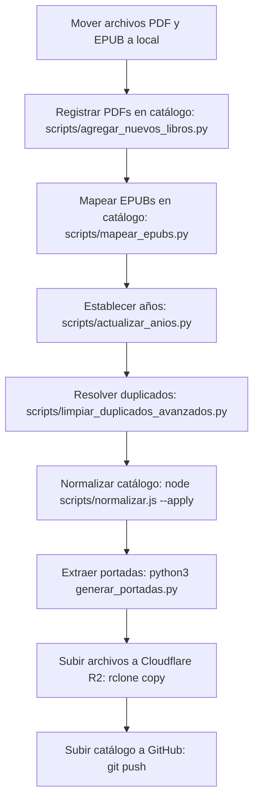

# 📖 Guía: Carga y Gestión de Libros (PDF, EPUB y Carga Masiva)

Esta guía describe los procedimientos y flujos de trabajo para añadir, mapear y sincronizar nuevos títulos en el catálogo de **Libractiva**, tanto en formato **PDF** como **EPUB**, utilizando herramientas automatizadas de importación, saneamiento y sincronización con la nube.

---

## ⚡ El Formato EPUB en Libractiva

Hemos incorporado soporte completo para descargas en formato **EPUB**. Los beneficios clave de ofrecer este formato a los donadores son:
- **Lectura Adaptativa (Flowable Text):** A diferencia del PDF, el EPUB adapta el texto al tamaño de pantalla del dispositivo (móviles, tablets y lectores electrónicos).
- **Compatibilidad con E-readers:** Formato ideal e indispensable para disfrutar de la lectura en dispositivos dedicados como **Kindle**, Kobo o aplicaciones móviles de lectura (Apple Books, Google Play Books).
- **Bajo Consumo de Espacio:** El peso de los archivos EPUB suele ser significativamente menor que el de un PDF escaneado, lo que agiliza su descarga y optimiza el almacenamiento.

---

## 🔄 Flujo de Trabajo General (Carga Masiva)



---

## 📂 Organización de Archivos en Local

Los libros físicos deben organizarse localmente en la carpeta `/home/daniel/biblioteca-digital/` con la siguiente estructura de directorios:

### Para archivos PDF:
```text
/home/daniel/biblioteca-digital/
├── A/
│   └── Allende, Isabel/
│       └── La casa de los espíritus - Isabel Allende.pdf
├── B/
│   └── Borges, Jorge Luis/
│       └── El Aleph - Jorge Luis Borges.pdf
```
*Las carpetas alfabéticas van de la `A` a la `Z`. La carpeta del autor sigue el formato `Apellido, Nombre`, mientras que el archivo del libro se nombra `{Título} - {Autor}.pdf`.*

### Para archivos EPUB:
Los EPUBs siguen exactamente la misma estructura de carpetas pero deben colocarse dentro del subdirectorio especial `001_EPUB/`:
```text
/home/daniel/biblioteca-digital/
└── 001_EPUB/
    ├── A/
    │   └── Allende, Isabel/
    │       └── La casa de los espíritus - Isabel Allende.epub
    └── B/
        └── Borges, Jorge Luis/
            └── El Aleph - Jorge Luis Borges.epub
```

---

## 🛠️ Herramientas y Scripts de Automatización

Contamos con varios scripts especializados en el directorio `scripts/` para realizar la catalogación masiva sin intervenciones manuales tediosas:

### 1. Importación Masiva de PDFs
Si copiaste múltiples archivos PDF nuevos a `/home/daniel/biblioteca-digital/`, ejecuta:
```bash
python3 scripts/agregar_nuevos_libros.py
```
**Qué hace:** 
- Escanea de forma recursiva los PDFs locales.
- Identifica cuáles **no están** registrados en `libros.json`.
- Extrae el título, el autor (invirtiendo el formato `Apellido, Nombre` de la carpeta a `Nombre Apellido`), y los añade con un nuevo ID secuencial.
- Asocia una descripción en blanco `""` para que puedas definir una descripción corta y real a cada libro posteriormente.

### 2. Mapeo de Archivos EPUB
Una vez que agregues nuevos archivos EPUB a la subcarpeta `001_EPUB/`, ejecuta:
```bash
python3 scripts/mapear_epubs.py
```
**Qué hace:**
- Escanea de forma recursiva el directorio `001_EPUB/`.
- Busca coincidencias de título y autor con los registros de `libros.json`.
- Asocia el campo `"archivo_epub"` en el JSON a los libros correspondientes.

### 3. Asignación Estricta de Años
Para inyectar rápidamente el año de publicación a los libros recién agregados, se puede usar:
```bash
python3 scripts/actualizar_anios.py
```
**Qué hace:**
- Contiene un mapa estricto de tuplas `(título, autor)` con sus respectivos años reales y los actualiza de golpe de forma segura.

### 4. Saneamiento de Autores y Duplicados
Al importar libros de carpetas locales, a veces surgen inconsistencias en los nombres o duplicados. Contamos con dos scripts de limpieza:
```bash
# Limpieza básica de nombres (remueve sufijos '(1)' y unifica autores/títulos de Stephen King)
python3 scripts/limpiar_duplicados_y_autores.py

# Fusión avanzada de duplicados de libros
python3 scripts/limpiar_duplicados_avanzados.py
```
**Qué hacen:**
- Si un libro se importó como duplicado porque el nombre del archivo incluía el autor (ej. `Evangelio de Judas-Anonimo.pdf` vs el original `Evangelio de Judas`), detecta la colisión.
- Transfiere los enlaces a los archivos PDF/EPUB del registro duplicado (sin metadatos) al registro principal (con descripción y portada).
- Elimina los registros duplicados sobrantes de `libros.json`.

### 5. Normalización y Consistencia de Formato
Para formatear el JSON y catalogar los géneros literarios dentro de las categorías padre unificadas de la web:
```bash
node scripts/normalizar.js --apply
```

### 6. Extracción Masiva de Portadas
Para extraer la primera página de los PDFs nuevos y guardarla automáticamente como miniatura WebP optimizada:
```bash
# Genera portadas WebP para todos los libros que tienen 'portada' vacío en libros.json
python3 scripts/extraer_portadas_faltantes.py
```

---

## ☁️ Sincronización con Cloudflare R2 (Almacenamiento)

Los archivos físicos (PDF y EPUB) se sirven a los usuarios desde **Cloudflare R2** a través de URLs firmadas de corta duración generadas por nuestro backend serverless. 

Para subir los nuevos libros agregados a la nube, ejecuta:
```bash
rclone copy /home/daniel/biblioteca-digital/ cloudflare:biblioteca-digital/ --progress
```

> [!tip] Comportamiento inteligente de R2 Sincronización
> Este comando es incremental: rclone comparará lo que ya está en Cloudflare R2 con tu disco local y **solo subirá los archivos nuevos o modificados**, ignorando los miles de libros que ya se encuentran arriba. Esto ahorra ancho de banda y tiempo.

---

## 🚀 Despliegue de Cambios en la Web

Una vez que tengas actualizados tus archivos locales en `libros.json` y generadas las miniaturas en `portadas/`, sube los cambios para redesplegar en Vercel:

```bash
git add libros.json portadas/
git commit -m "feat: incorporar nuevos títulos al catálogo de Libractiva"
git push
```
*(Si la terminal falla al empujar por permisos de cuenta, realiza el push de forma manual utilizando tu cliente Git habitual o GitHub Desktop).*

---
**Notas Relacionadas:**
- [[Guía - Git y Flujo de Trabajo|Trabajo con ramas y Vercel]]
- [[Guía - Generar Portadas|Detalles de pdftoppm y conversión]]
- [[Arquitectura - Estructura de Datos|Propiedades del archivo libros.json]]
