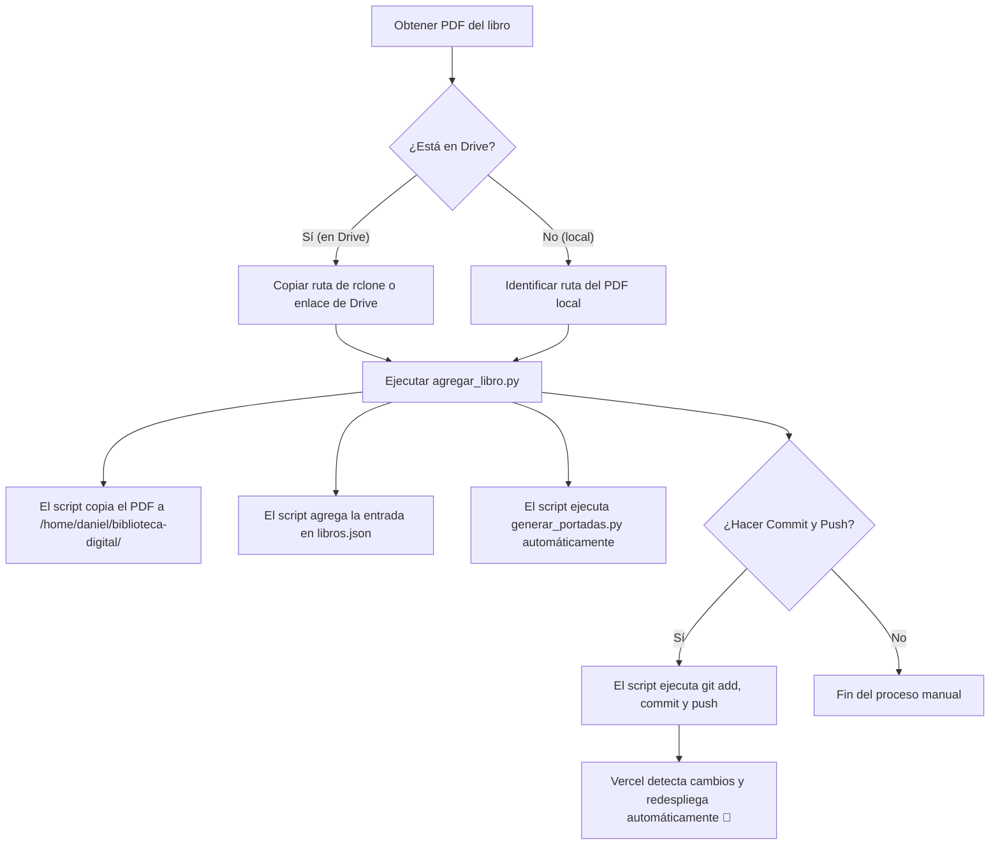

# 📖 Guía: Agregar Libro al Catálogo

Esta guía describe el procedimiento estándar para añadir nuevos títulos al catálogo de **Libractiva**. Contamos con un script en Python (`agregar_libro.py`) diseñado para automatizar la mayoría de los pasos (copia del archivo, actualización del JSON, extracción de la portada y confirmación en Git).

---

## 🔄 Flujo de Trabajo General



---

## 🛠️ Modos de Ejecución del Script

El script está ubicado en la raíz del repositorio: `/home/daniel/biblioteca/agregar_libro.py`. Puedes ejecutarlo en tres modos:

### 1. Modo Interactivo (Recomendado)
Es el método más guiado. Te preguntará de dónde proviene el PDF y los metadatos de forma conversacional.

**Cómo ejecutarlo:**
```bash
python3 agregar_libro.py
```

El script te guiará con los siguientes pasos:
1.  **Origen del PDF:** Elige si está en una ruta local (opción 1), si ya lo copiaste a la biblioteca de PDFs (opción 2) o si quieres descargarlo de Google Drive mediante `rclone` (opción 3).
2.  **Autocompletado de datos:** Si el PDF local tiene el formato estándar `Título - Autor.pdf`, el script pre-rellenará el título y el autor automáticamente.
3.  **Año y Género:** Introduce el año. Para el género, te presentará una lista numerada con los géneros populares para que selecciones o escribas uno nuevo.
4.  **Enlace de Google Drive:** Introduce el enlace compartido de Google Drive. El script lo convertirá automáticamente a formato `/preview` si es necesario.
5.  **Generación de Portada:** Se invocará a `generar_portadas.py` en segundo plano para extraer la miniatura en WebP.
6.  **Git Commit y Push:** Te preguntará si deseas subir el cambio directamente a GitHub.

---

### 2. Modo Rclone (Cuando el PDF está en Google Drive)
Si sincronizas tus carpetas con Google Drive usando `rclone` (remoto llamado `biblioteca`), puedes pasarle la ruta remota directamente.

**Ejemplo:**
```bash
python3 agregar_libro.py --rclone "biblioteca:biblioteca-digital/W/Wolynn, Mark/Este dolor no es mío.pdf"
```

El script descargará el PDF en segundo plano y te preguntará de forma interactiva el resto de los campos.

---

### 3. Modo Batch (No interactivo)
Útil para automatizar cargas masivas o si prefieres pasar todos los datos en una sola línea de comandos.

**Ejemplo:**
```bash
python3 agregar_libro.py \
  --batch \
  --titulo "1984" \
  --autor "George Orwell" \
  --anio 1949 \
  --genero "Ciencia Ficción" \
  --descripcion "Novela distópica clásica sobre el Gran Hermano." \
  --pdf "https://drive.google.com/file/d/1XXXXXX_FILE_ID_XXXXXX/preview" \
  --pdf-local ~/Descargas/1984.pdf
```

---

## ⚠️ Checklist e Información Importante

> [!important] Requisitos del archivo PDF
> - El archivo debe nombrarse exactamente `{Título} - {Autor}.pdf`.
> - Debe guardarse localmente en `/home/daniel/biblioteca-digital/{Letra}/{Autor}/`. El script se encarga de crear las carpetas y moverlo si le proporcionas el PDF al iniciarlo.
> - **Formato del Autor:** En el campo `"autor"` de `libros.json`, el nombre siempre debe ser **`Nombre Apellido`** (ej. `"Ernesto Sabato"`), ya que así lo requiere el filtro del frontend de la web. En cambio, en la estructura física de directorios se usa **`Apellido, Nombre`** (ej. `S/Sabato, Ernesto/`).

> [!warning] Permisos de Google Drive
> El link del PDF debe estar configurado en Google Drive como **"Cualquiera con el enlace puede ver"**. De lo contrario, los visitantes de la web se encontrarán con un error de acceso al hacer clic en "Ver documento".

> [!tip] Formato de Enlace de Drive
> Si copias el enlace estándar de Drive (`https://drive.google.com/file/d/ID/view?usp=sharing`), el script lo normalizará al formato `/preview` (`https://drive.google.com/file/d/ID/preview`), que permite embeber la visualización dentro del navegador.

---

## 🔧 Resolución de Problemas

### La portada no se generó
*   **Causa común:** El título del libro registrado en el JSON no coincide exactamente (ignorando acentos y mayúsculas) con el nombre del archivo PDF en el disco.
*   **Solución:** Modifica el título en `libros.json` para que coincida con el archivo, o renombra el PDF y vuelve a ejecutar el script de portadas: `python3 generar_portadas.py`.

### Error de JSON inválido tras la edición
*   Si editaste `libros.json` a mano y rompiste una coma o llave, puedes verificar la validez sintáctica del JSON ejecutando:
    ```bash
    python3 -c "import json; json.load(open('libros.json')); print('OK')"
    ```

---
**Notas Relacionadas:**
*   [[Guía - Generar Portadas|Generación automática de portadas]]
*   [[Guía - Git y Flujo de Trabajo|Actualizaciones con comandos de Git]]
*   [[Arquitectura - Estructura de Datos|Detalles de libros.json]]
