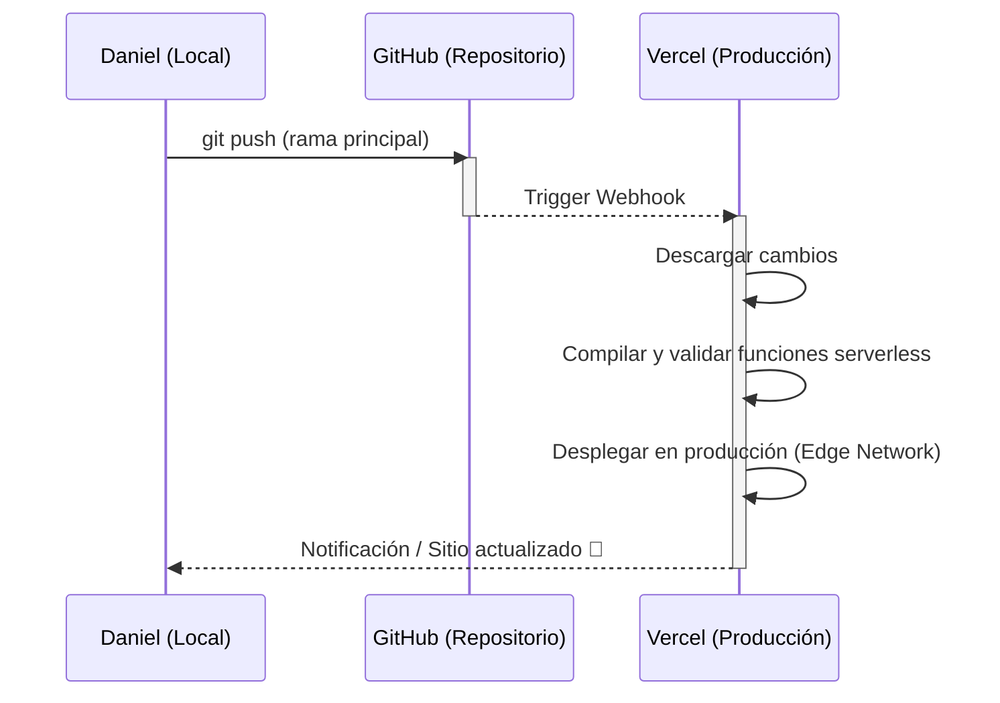

# 🚀 Guía: Despliegue en Vercel

Esta guía detalla el entorno de ejecución, la configuración de variables de entorno y los procedimientos necesarios para desplegar y probar localmente la **Biblioteca Digital** en Vercel.

---

## 🏗️ Flujo de Despliegue Continuo (CI/CD)

El proyecto está conectado a Vercel mediante integración con GitHub. Esto automatiza por completo el flujo de despliegue:



---

## 🛠️ Desarrollo y Pruebas Locales

Dado que el recomendador inteligente utiliza una **función serverless** de Node.js ubicada en `api/recomendar.js`, abrir el archivo `index.html` directamente en el navegador no permitirá que la IA funcione (dará error al hacer peticiones a `/api/recomendar`).

Para emular el entorno de Vercel en tu computadora local:

### 1. Requisitos Previos
Debes tener instalado Vercel CLI globalmente en tu sistema a través de npm:
```bash
sudo npm install -g vercel
```

### 2. Iniciar el Servidor de Desarrollo Local
Ejecuta el siguiente comando en la raíz del proyecto para levantar el emulador:
```bash
vercel dev
# O alternativamente usando el script configurado en package.json:
npm run dev
```

Esto iniciará un servidor local (usualmente en [http://localhost:3000](http://localhost:3000)) que:
*   Sirve los archivos estáticos (`index.html`, `style.css`, `app.js`, `libros.json`, y la carpeta `portadas/`).
*   Expone las rutas `/api/*` mapeando correctamente la función local `api/recomendar.js`.
*   Carga tus variables de entorno locales si configuraste un archivo `.env` en la raíz.

---

## 🔑 Variables de Entorno

La API de recomendaciones requiere una clave de acceso válida para comunicarse con el modelo DeepSeek.

### En Producción (Panel de Vercel)
La clave está configurada en la sección de configuración de Vercel:
1.  Ingresa a tu dashboard en [vercel.com](https://vercel.com).
2.  Navega a: **Project Settings** > **Environment Variables**.
3.  La variable debe llamarse exactamente:
    ```env
    DEEPSEEK_API_KEY=sk-xxxxxxxxxxxxxxxxxxxxxxxxxxxxxxxx
    ```
4.  Se encuentra encriptada y se inyecta automáticamente en el worker serverless al arrancar.

### En Desarrollo Local
Para probar la función de la IA en tu entorno local:
1.  Crea un archivo llamado `.env` en la raíz de tu proyecto (este archivo está excluido en el `.gitignore` por seguridad).
2.  Agrega tu clave de la API en el archivo:
    ```env
    DEEPSEEK_API_KEY=tu_clave_privada_de_deepseek
    ```
3.  Al iniciar `vercel dev`, la herramienta leerá el archivo `.env` e inyectará la variable localmente.

---

## 📦 Configuración del Proyecto (`vercel.json`)

El archivo `vercel.json` en la raíz contiene las directivas esenciales para indicarle a Vercel el comportamiento del despliegue:

```json
{
  "version": 2,
  "public": true,
  "github": {
    "silent": true
  }
}
```

*   **`version: 2`**: Especifica el uso de la plataforma de despliegue Vercel 2.0 (basada en microservicios y serverless).
*   **`public: true`**: Permite ver el código fuente desplegado en el inspector de Vercel (opcional).
*   **`github.silent: true`**: Evita comentarios excesivos del bot de Vercel en los commits de GitHub.

---
**Notas Relacionadas:**
*   [[Guía - Git y Flujo de Trabajo|Actualizar la biblioteca mediante Git]]
*   [[Arquitectura - API de Recomendación|Cómo funciona internamente la API de DeepSeek]]
*   [[Guía - Agregar Libro|Procedimiento para subir un libro]]
