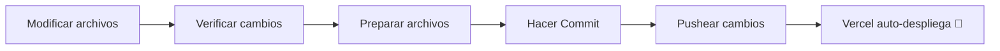

# 💻 Guía: Git y Flujo de Trabajo

Esta guía explica detalladamente el uso de Git y el flujo de trabajo en el repositorio de la **Biblioteca Digital** para mantener el catálogo sincronizado y desplegado en producción de manera segura.

---

## 🏗️ Flujo de Trabajo Diario

Toda actualización de la biblioteca (agregar un libro, cambiar un estilo o normalizar datos) se realiza siguiendo este ciclo de desarrollo:



---

## 🛠️ Comandos Esenciales de Git

A continuación, se listan los comandos necesarios para realizar actualizaciones manuales:

### 1. Verificar el Estado del Repositorio
Antes de hacer cambios o registrar nuevos archivos, revisa qué archivos han sido modificados o agregados:
```bash
git status
```
Este comando te mostrará los archivos modificados (como `libros.json`) y archivos no rastreados (como nuevas imágenes en la carpeta `portadas/`).

### 2. Registrar los Cambios (Staging)
Debes indicarle a Git qué archivos quieres incluir en tu próxima confirmación de versión.

*   **Para registrar el catálogo y las portadas nuevas:**
    ```bash
    git add libros.json portadas/
    ```
*   **Para registrar un cambio específico (ej. un archivo de estilos):**
    ```bash
    git add style.css
    ```
*   **Para registrar todo lo modificado:**
    ```bash
    git add .
    ```

### 3. Crear una Confirmación de Versión (Commit)
Consiste en guardar localmente una foto de los cambios agregados con un mensaje descriptivo que resuma lo realizado.

**Ejemplo de mensaje para libros:**
```bash
git commit -m "nuevo libro: 1984 - George Orwell"
```

**Ejemplo para mejoras de código:**
```bash
git commit -m "corrección: ajustar contraste del texto suave en modo oscuro"
```

### 4. Enviar Cambios a GitHub (Push)
Sube las confirmaciones locales a tu servidor remoto en GitHub. Al hacer esto, **Vercel detecta la actualización y reconstruye la web en menos de 1 minuto**.
```bash
git push origin main
# O simplemente:
git push
```

---

## 🤖 Integración Automatizada en el Script

Recuerda que el script interactivo `agregar_libro.py` cuenta con un paso final automatizado. Si respondes **"s"** o **"si"** a la pregunta de confirmación final:
1.  Ejecutará internamente `git add libros.json portadas/`.
2.  Generará un commit con el mensaje formateado: `"nuevo libro: {Título} - {Autor}"`.
3.  Ejecutará `git push` de manera automática.

Si el comando automático falla (debido a problemas de credenciales de GitHub en la terminal), el script te lo indicará para que ejecutes la subida manual.

---

## ⚠️ Consejos de Seguridad y Buenas Prácticas

> [!caution] No subas credenciales
> Jamás agregues el archivo `.env` o archivos con claves de API de DeepSeek a Git. El archivo `.gitignore` ya cuenta con reglas para prevenirlo. Siempre verifica con `git status` que no estés registrando archivos sensibles.

> [!tip] Mantén limpio el repositorio
> No guardes archivos temporales (`*.bak`, `*.tmp`) en el repositorio. Si creas backups temporales del catálogo al realizar ediciones manuales, bórralos una vez confirmada la validez del archivo principal.

---
**Notas Relacionadas:**
*   [[Guía - Agregar Libro|SOP para añadir libros]]
*   [[Guía - Despliegue en Vercel|Cómo procesa Vercel el git push]]
