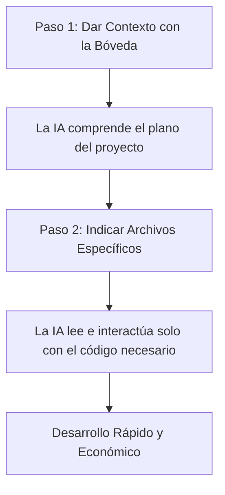

# 🤖 Guía: Uso con Agentes de IA

Esta guía está diseñada para que tú (u otros desarrolladores) sepán cómo interactuar de manera eficiente con **agentes de Inteligencia Artificial** (como Claude Code, Hermes Agent, GitHub Copilot, etc.) al realizar modificaciones o mantenimiento en este proyecto.

---

## ⚠️ El Desafío del Contexto (Tokens y Costes)

Este repositorio contiene dos elementos muy pesados que **no aportan valor lógico** al código de programación, pero que consumen una gran cantidad de memoria (tokens) si la IA intenta leerlos:

1.  **`libros.json` (~1.1 MB):** Contiene el catálogo completo de más de 2,843 libros. Si un agente de IA lee este archivo por completo, consumirá más de **220,000 tokens de entrada** en cada consulta. Esto ralentiza las respuestas, aumenta el coste drásticamente y puede hacer que la IA "olvide" instrucciones debido a la saturación de contexto.
2.  **`portadas/` (Carpeta con ~2,850 WebPs):** Es una carpeta con miles de imágenes binarias. Las IAs no necesitan analizar estas imágenes para corregir o mejorar el código del sitio.

---

## 🔄 Flujo de Trabajo Recomendado

Para realizar cambios de manera eficiente y barata, guía a los agentes de IA utilizando este procedimiento:

### Paso 1: Inicialización con la Bóveda (El Plano)
Pídele al agente de IA que lea el archivo `00 - Inicio.md` y las notas de arquitectura en `boveda/`. Esto le dará una comprensión completa de la estructura del software sin consumir apenas tokens.

### Paso 2: Edición Dirigida (Los Ladrillos)
Una vez que el agente sabe qué hace cada archivo, indícale qué archivo de código específico debe leer y modificar:
*   Para diseño visual: `style.css` e `index.html`.
*   Lógica de comportamiento, búsquedas o UI: `app.js`.
*   Lógica del recomendador IA o DeepSeek: `api/recomendar.js`.

---

## 💬 Prompts Listos para Copiar y Pegar

Puedes usar estos prompts exactos al abrir una nueva conversación con un agente de IA:

### Para el primer análisis del proyecto:
> *"Analiza la documentación del proyecto leyendo la nota de inicio en `boveda/00 - Inicio.md` y los archivos bajo `boveda/02 - Arquitectura Técnica/`. **IMPORTANTE:** No leas el archivo `libros.json` ni la carpeta `portadas/` ya que contienen únicamente datos del catálogo y portadas binarias que no son relevantes para entender la lógica del software."*

### Para solicitar una modificación en el diseño (CSS):
> *"Necesito modificar [describir cambio visual]. De acuerdo al mapa del proyecto en la bóveda, lee los archivos `style.css` e `index.html` y realiza los cambios ahí. Recuerda no leer `libros.json`."*

### Para modificar la API de recomendación (DeepSeek):
> *"Necesito ajustar [describir cambio en la IA]. Basándote en lo documentado en `boveda/02 - Arquitectura Técnica/Arquitectura - API de Recomendación.md`, lee el archivo `api/recomendar.js` y propón los cambios necesarios."*

---
**Notas Relacionadas:**
*   [[Arquitectura - Estructura del Proyecto|Mapa completo de archivos]]
*   [[Arquitectura - Vista General|Stack técnico del sistema]]
*   [[Guía - Despliegue en Vercel|Cómo probar cambios localmente]]
