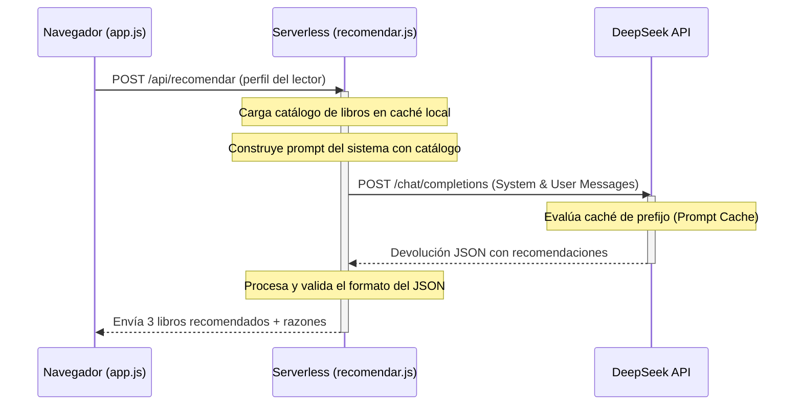

# 🤖 Arquitectura: API de Recomendación

Este documento detalla el diseño, la lógica y la optimización de costes del recomendador inteligente por IA de **Libractiva**, implementado en la ruta serverless `api/recomendar.js`.

---

## 🛠️ Entorno y Conectividad

La API está desarrollada como una función Serverless de Vercel (Node.js). Actúa como un intermediario seguro (Proxy) entre el cliente web y la API oficial de DeepSeek.



---

## 🧠 Optimización del Prompt: Prompt Caching

Enviar el catálogo completo de casi 3,000 libros en cada consulta consumiría una cantidad excesiva de tokens y dispararía los costos de la API. Para solucionar esto, implementamos una estrategia de **Prompt Caching** (Prefix Caching) provista por DeepSeek:

1.  **Formato de Catálogo Compacto:**
    En lugar de enviar el JSON completo de metadatos (descripciones, URLs, etc.), convertimos el catálogo a un formato crudo super-compacto de texto:
    ```text
    id|título|autor|género
    ```
    Ejemplo: `12|1984|George Orwell|Ciencia Ficción`
2.  **Mensaje de Sistema Persistente:**
    Ubicamos el catálogo completo dentro de las instrucciones del **System Message**. Dado que el sistema no cambia entre consultas, la API de DeepSeek reconoce que es el mismo prefijo que en llamadas anteriores y activa la caché.
3.  **Ahorro de Costes:**
    *   Costo de tokens de entrada normales: ~$0.14/M tokens.
    *   Costo de tokens en caché (Cache Hit): ~$0.014/M tokens.
    *   Esto reduce el costo de procesamiento del prompt de entrada en aproximadamente un **80% a 90%** a partir de la segunda consulta.

---

## 📋 Prompting e Instrucciones de la IA

### System Message (Instrucciones & Datos Fijos)
```text
Eres un bibliotecario experto, cálido y breve. Siempre respondes SOLO con JSON válido, sin texto adicional.

CATÁLOGO DISPONIBLE:
{catálogo compacto...}

INSTRUCCIONES PARA RECOMENDAR:
1. Analiza el perfil del lector que te enviará el usuario y compáralo con los géneros y títulos del catálogo.
2. Elige los 3 libros que mejor se ajusten a su estado y necesidad actual.
3. Responde ÚNICAMENTE con un JSON válido, sin bloques de código (sin ```), sin explicaciones fuera del JSON.
4. El formato debe ser exactamente este:
[
  { "id": 12, "razon": "Explicación personalizada y cálida..." },
  ...
]
```

### User Message (Datos Dinámicos del Perfil)
```text
PERFIL DEL LECTOR:
- Estado de ánimo: {estado}
- Tiempo disponible para leer: {tiempo}
- Quiere: {objetivo}
- Tema de interés: {tema}
```

---

## 🛡️ Robustez y Manejo de Respuestas

Los modelos de lenguaje en ocasiones fallan al seguir instrucciones estrictas de formato (por ejemplo, devolviendo la respuesta envuelta en bloques markdown ` ```json ` o añadiendo textos explicativos al principio o al final).

Para garantizar la estabilidad del sitio web, la API implementa dos capas de robustez:

### 1. Limpieza de Texto (Sanitización)
La función `parsearRecomendaciones` limpia la respuesta del modelo removiendo marcas de código comunes antes de intentar procesar el JSON:
```javascript
const textoLimpio = texto
  .trim()
  .replace(/^```json\s*/i, '')
  .replace(/^```\s*/i, '')
  .replace(/\s*```$/i, '');
```

### 2. Ciclo de Reintento (Fallback)
Si el parseo de la respuesta falla (el JSON no es válido o está incompleto), la API no devuelve un error al cliente inmediatamente. En su lugar, **realiza un segundo intento** de manera transparente para el usuario:
*   Realiza una nueva petición al modelo DeepSeek enviando la conversación previa.
*   Añade un mensaje correctivo: *"Tu respuesta anterior no es JSON válido. Responde ÚNICAMENTE con el array JSON en el formato indicado..."*.
*   Reduce la temperatura del modelo a `0.3` (haciéndolo más determinista y estricto con el formato).
*   Si este segundo intento tiene éxito, procesa las recomendaciones normalmente.

---
**Notas Relacionadas:**
*   [[Guía - Despliegue en Vercel|Cómo levantar la API en desarrollo local]]
*   [[Arquitectura - Estructura de Datos|Propiedades de libros.json]]
*   [[Arquitectura - Auditoría y Rendimiento|Auditoría de rendimiento y caching en la nube]]
