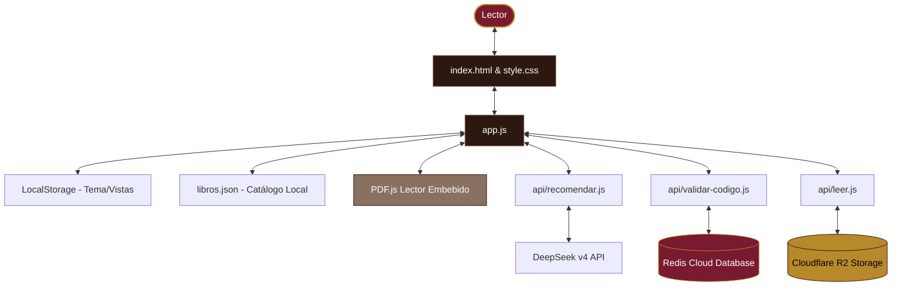

# ⚙️ Arquitectura: Vista General

Este documento describe la estructura arquitectónica general y las decisiones de diseño del sistema para la **Biblioteca Digital**.

---

## 🎨 Diseño Conceptual

El proyecto está diseñado bajo una filosofía de **simplicidad técnica máxima en el cliente** y una **estética visual editorial premium**. Utiliza tecnologías puras de la web (Vanilla stack) para garantizar rapidez, mantenibilidad y nulas dependencias pesadas.

---

## 📦 Stack Tecnológico

### 1. Frontend (Cliente)
*   **HTML5 Semántico:** Estructura modular e interfaces accesibles (modales, buscador, filtros, paginación, visor PDF).
*   **Vanilla CSS3 (Variables Custom):** Estilos basados en un sistema de diseño estricto (vino, dorado, crema). Soporta transiciones suaves de color y un modo oscuro con la propiedad `data-theme`.
*   **Vanilla JavaScript (ES6+):** Lógica del lado del cliente sin frameworks (React/Vue). Se encarga de:
    *   Cargar y procesar el archivo `libros.json` de 1.3 MB mediante `fetch`.
    *   Filtrar los libros en tiempo real mediante búsqueda por palabras clave normalizadas.
    *   Navegar mediante rutas de hash (`#/libro/{id}`).
    *   Controlar la paginación y renderizar las tarjetas.
*   **PDF.js (de Mozilla):** Lector de PDF embebido cargado desde CDN que renderiza los libros directamente sobre un `<canvas>`. Permite controles personalizados de zoom, paginación y ajuste de ancho con adaptabilidad a móviles.
*   **Lucide Icons:** Iconografía moderna inyectada dinámicamente usando la biblioteca externa de Lucide.

### 2. Backend (Servicios Serverless en Vercel)
*   **`api/recomendar.js`**: Procesa la encuesta del lector y consulta a la API del recomendador IA.
*   **`api/leer.js`**: Genera URLs firmadas seguras de Cloudflare R2 con expiración corta (3 a 10 min) para lectura online y descargas.
*   **`api/validar-codigo.js`**: Valida códigos de donador y administra los límites de dispositivos contra la base de datos de Redis.
*   **Node.js 20.x:** Entorno de ejecución en la nube para las APIs serverless de Vercel.

### 3. Almacenamiento y Bases de Datos
*   **Cloudflare R2 Object Storage:** Almacenamiento de archivos PDF de libros (más de 30 GB en total). Sustituye a Google Drive, permitiendo descargas directas y lectura fluida por rangos mediante URLs firmadas.
*   **Redis Cloud (Redis Labs):** Base de datos en memoria para gestionar y validar en milisegundos los códigos de acceso de donadores y los IDs de dispositivos registrados.

### 4. Inteligencia Artificial
*   **DeepSeek v4 Flash:** API remota consultada mediante peticiones POST seguras para procesar perfiles de lectura y emitir recomendaciones.

---

## 💡 Decisiones de Diseño Clave

### 1. Carga Completa del Catálogo en el Cliente
*   **Decisión:** El catálogo de ~2,843 libros está almacenado en un solo JSON estático (`libros.json`). La aplicación lo descarga por completo al iniciar la web y realiza las búsquedas directamente en memoria en la computadora del usuario.
*   **Pros:** Búsquedas instantáneas, nulo costo de base de datos, arquitectura ultra simple.
*   **Contras:** La carga inicial requiere descargar ~1.1 MB (que se reduce a ~300 KB con compresión gzip en Vercel), lo cual puede tardar algunos segundos en conexiones móviles lentas.

### 2. Modo Oscuro Nativo
*   El tema se controla agregando el atributo `data-theme="dark"` al elemento raíz `<html>`. Las variables CSS cambian dinámicamente y el estado se almacena en el `localStorage` del cliente bajo la clave `tema` para persistir la preferencia en siguientes visitas.

### 3. Rutas Hash (`#/libro/{id}`)
*   Para evitar redireccionamientos y no perder la velocidad de una Single Page Application (SPA), la apertura de los detalles del libro se realiza con un modal que actualiza el hash de la URL. Esto permite a los usuarios compartir enlaces directos a obras específicas de la colección.

---

## 🔍 SEO e Indexación
Para asegurar que los motores de búsqueda indexen correctamente el sitio:
*   **JSON-LD SEO Dinámico:** El script `app.js` inyecta etiquetas de metadatos `schema.org` estructuradas en el `<head>` dependiendo de la página o libro activo.
*   **Sitemap y Robots:** Archivos estáticos en la raíz que guían a los buscadores a indexar la página principal bloqueando los scripts internos del backend.

---
**Notas Relacionadas:**
*   [[Arquitectura - Estructura del Proyecto|Estructura de archivos y carpetas]]
*   [[Arquitectura - API de Recomendación|Lógica del recomendador inteligente]]
*   [[Arquitectura - Estructura de Datos|Diseño de libros.json]]
