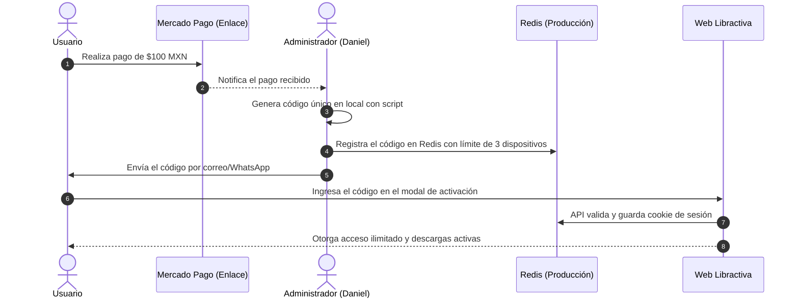

# 💸 Modelo de Negocio: Acceso Lifetime (LTD)

Este documento detalla la estrategia de monetización, la propuesta de valor y el flujo comercial implementado en **Libractiva** para garantizar la viabilidad y rentabilidad del proyecto.

---

## 🚀 De Donaciones a Oferta Irresistible (Pago Único)

Inicialmente, el proyecto contemplaba un modelo de "donaciones voluntarias" para financiar los servidores y APIs. Este modelo ha sido sustituido por una **Oferta de Pago Directo (Lifetime Deal - LTD)** debido a las siguientes razones de negocio:
- El modelo de donaciones voluntarias no genera ingresos consistentes para cubrir infraestructura crítica (Cloudflare R2, APIs de LLMs).
- Los usuarios no buscan "apoyar una causa cultural", sino resolver una fricción inmediata: **el acceso simple, rápido y la certeza de qué leer**.

### 💎 La Propuesta de Valor
No vendemos una biblioteca masiva (2,800+ libros). Vendemos:
1. **Tiempo mental recuperado:** El recomendador inteligente elimina la parálisis de decisión de no saber qué leer.
2. **Cero fricción de lectura:** Visor web instantáneo, descargas limpias en PDF y formato EPUB optimizado para lectores Kindle o apps favoritas.
3. **Certeza absoluta:** Solo libros normalizados, catalogados con descripciones precisas, sin spam ni metadatos rotos.

---

## 💳 Detalles del Producto y Cobro

- **Precio:** **$100 MXN** (Pago Único para toda la vida).
- **Procesador de Pagos:** Mercado Pago.
- **Enlace de Pago Activo:** `https://mpago.la/1Ek1HPz`
- **Límite de Acceso:** Hasta **3 dispositivos** registrados simultáneamente por cada código generado.

---

## 🔄 Flujo del Proceso de Venta y Activación

El flujo de monetización y entrega se gestiona de la siguiente manera:



### 1. Cobro (Mercado Pago)
El usuario hace clic en el botón de compra en el panel de bloqueo de la web o en el modal de códigos, lo que le redirige a la pasarela segura de Mercado Pago.

### 2. Generación del Código (Local)
Tras recibir la confirmación de pago, el administrador ejecuta el generador local para obtener un nuevo código libre:
```bash
python3 /home/daniel/002_CODIGOS/generar_codigo.py
```
Se registra el nombre y correo del comprador en `lista_codigos.csv` asociándolo a dicho código.

### 3. Activación del Código en Redis
El código generado debe subirse a la base de datos de producción mediante:
```bash
python3 scripts/agregar_donador.py <CODIGO_GENERADO>
```

### 4. Entrega y Uso
Se entrega el código de acceso al cliente (ej. `LTD-A3B9`). Al ingresarlo en la interfaz web de Libractiva, el usuario obtiene acceso indefinido a lectura completa y descargas.

---
**Notas Relacionadas:**
*   [[Guía - Gestión de Accesos|Guía para la administración de códigos y límites de dispositivos]]
*   [[Marca - Libractiva|Estrategia de posicionamiento e identidad de la marca]]
